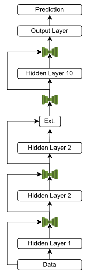
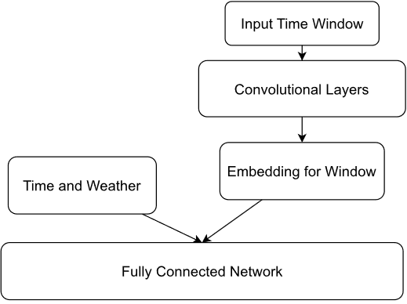
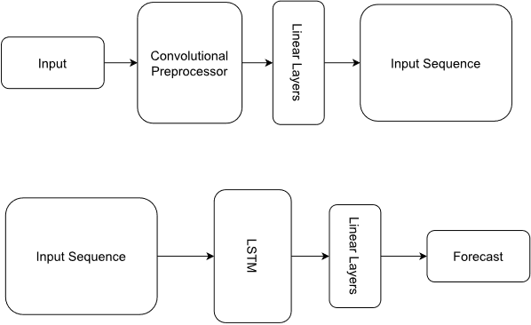
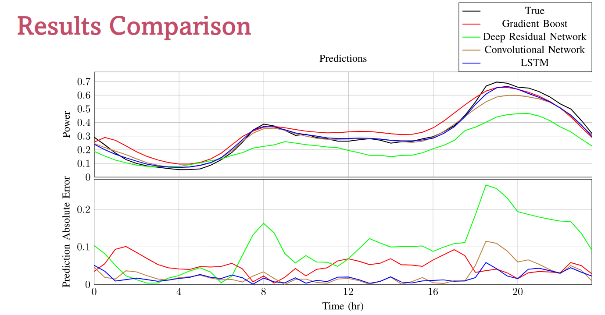
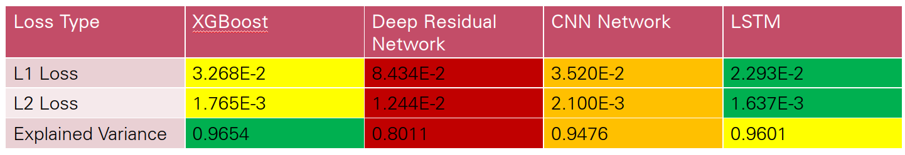

# Power_Forecasting_With_DNN

## Introduction

This is a project for power consumption forecasting with deep neural networks. This project utilized several different neural network architectures to predict power consumption.

## Data and Data Preprocessing

The data is from [Kaggle](https://www.kaggle.com/datasets/jeanmidev/smart-meters-in-london). The data is from smart meters in homes in the london area dataset. The data is from 2011 to 2014. The data is in 30 min intervals. The data contains power data per half hour as well as several weather features.

To process the weather data, the data is augmented it to match the half hour frequency of the power data set through the use of quadratic interpolation. For descriptive columns the descriptors from the preceding rows are copied. The important columns and processes from the descriptor headings are processed into numerical values. After this processing, the weather data contains the following information: visibility, temperature, dew point, pressure, wind speed, precipitation
type, and humidity.  

The power data is normalized by first summing the power consumption across all households for each time interval and divided by the total number of homes per time index. All values are then normalized using sklearn's MinMaxScaler.

## Training Methodology

A standard 70% Training, 10 % Validation, 20% Testing split was used.

## Models

### Baseline Model

To compare our neural networks the XGBoost algorithm is utilized. The number of estimators used was 1000.

### Deep Residual Network

The first neural network the team uses is a Deep Residual Neural network. This network and all proceeding networks were implemented in PyTorch. Knowing that time series forecasting is an extremely complicated problem for a single output, the team knows a linear network needs many layers to meaningfully process the input and predict an output window. As a result, the team uses residual connections between each layer to reduce the vanishing gradient problem that plagues neural networks deeper than 7 layers.

The above figure  shows the overall architecture of the Deep Residual network. As can be seen, the residual connections are in the form of concatenating the output of a layer with its input. This allows the deep residual network to have 10 layers with roughly 1000 nodes at each hidden layer. However the ultra-deepness of the Deep Residual Network also comes at the cost of having millions of learnable parameters.

### Convolutional Preprocessing - Fully Connected (CONV)

For this section, the team employs a convolutional pre-processing (CONV) layer before the dense layers of the neural network to take advantage of the time dependence of the input window as in [7]. This layer effectively acts as a feature extraction layer for the power consumption data, allowing for more meaningful input to the dense layers. Meaning there is locality between each half hour measurement in the input window and a convolution through time helps the network extract these features more effectively before the dense layers. To implement the CONV layer, the team uses a one dimensional convolution across the power consumption features and then concatenates the weather data onto the result before the dense layers as in below figure.

### (CONV) - LSTM

Building off the success of the CONV layer, the team identifies the use of an LSTM will take advantage of the interdependence of each point in the output window on one another. Looking at each half hour prediction in the 24 hour output window, all predictions (except for the first) are dependent on all previous predictions. This is the perfect instance to implement an LSTM because of the cyclical method of inference. The team implements the LSTM architecture shown in the below figure , by first using a CONV layer to extract features from the power consumption data. The team then uses a linear layer to expand the extracted features into an input sequence for the LSTM. Finally, the team uses an LSTM to process the input sequence and linear layers to decode outputs from the LSTM into a power forecast.

## Results

### Final Day Forecast Comparison

The below figure shows the final day in the test set for each model. The true results are also shown for comparison. The CONV-LSTM model is the most accurate, followed by XGBoost, then the CONV model, and finally the Deep Residual Network. The XGBoost model does tend to overestimate which can be a conservative estimate for power consumption.

### Loss Comparison

### Training Time Comparison

